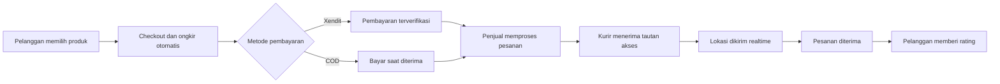

# UMKM Lampung Barat

### Marketplace digital untuk produk lokal dan kebutuhan pertanian Lampung Barat

Mendukung pelaku UMKM dalam memasarkan produk, mengelola pesanan, menerima pembayaran, dan mengatur pengantaran melalui satu platform terintegrasi.

[Tentang](#tentang-aplikasi) · [Fitur](#fitur-berdasarkan-aktor) · [Alur Transaksi](#alur-transaksi) · [Tech Stack](#tech-stack)

---

## Tentang Aplikasi

**UMKM Lampung Barat** adalah platform marketplace yang mempertemukan masyarakat dengan pelaku UMKM lokal di Kabupaten Lampung Barat. Produk yang tersedia mencakup hasil bumi, produk lokal, agrokimia, pupuk, benih, perlengkapan tani, serta alat dan suku cadang pertanian.

Platform menangani proses belanja dari pencarian produk hingga pesanan diterima. Ongkos kirim dihitung otomatis berdasarkan zona kecamatan, pembayaran dapat dilakukan melalui COD atau invoice Xendit, dan posisi kurir dapat dipantau secara realtime selama pengantaran.

## Fitur Berdasarkan Aktor

| Aktor | Akses | Fokus Utama |
| --- | --- | --- |
| **Pengunjung** | Tanpa akun | Menjelajahi katalog produk, kategori, dan toko UMKM. |
| **Pelanggan** | Akun pelanggan | Berbelanja, membayar, memantau pesanan, dan memberikan ulasan. |
| **Penjual** | Akun penjual terverifikasi | Mengelola toko, produk, pesanan, kurir, rekening, dan laporan. |
| **Admin** | Akun administrator | Memverifikasi penjual, mengelola platform, dan memantau transaksi. |
| **Kurir** | Tautan sekali pakai | Membagikan lokasi dan menyelesaikan proses pengantaran tanpa akun. |

### Pengunjung dan Pelanggan

- Menjelajahi dan mencari produk berdasarkan nama, kategori, atau toko.
- Melihat detail produk, stok, harga, jumlah terjual, rating, dan informasi toko.
- Mengelola keranjang atau menggunakan fitur **Beli Sekarang**.
- Checkout produk dari satu atau beberapa toko dengan pesanan terpisah per toko.
- Mendapatkan perhitungan ongkos kirim otomatis berdasarkan zona kecamatan toko dan pelanggan.
- Memilih pembayaran **COD** atau invoice digital melalui **Xendit**.
- Melihat riwayat, detail, pembayaran, dan perubahan status pesanan.
- Memantau lokasi kurir secara realtime ketika pengantaran sedang aktif.
- Memberikan rating dan ulasan setelah pesanan selesai.

### Penjual

- Mendaftarkan usaha dan menunggu persetujuan admin sebelum mulai berjualan.
- Mengelola profil toko, foto, produk, kategori, harga, dan ketersediaan stok.
- Menerima serta memproses pesanan pelanggan melalui dashboard penjual.
- Menugaskan kurir dan mengirimkan tautan pengantaran melalui WhatsApp.
- Memperbarui data kurir dengan otomatis mengganti tautan akses sebelumnya.
- Mengelola rekening bank dan status verifikasinya untuk pencairan dana.
- Menerima notifikasi pesanan dan perubahan status secara realtime.
- Melihat statistik penjualan serta mengunduh laporan dalam format PDF.

### Admin

- Memantau jumlah penjual, pelanggan, pesanan, transaksi, dan pendapatan platform.
- Meninjau dan menyetujui atau menolak pendaftaran toko.
- Memverifikasi informasi rekening bank milik penjual.
- Mengelola kategori yang digunakan pada katalog produk.
- Memantau transaksi dan performa penjual berdasarkan periode laporan.
- Mengunduh laporan kinerja platform dalam format PDF.

### Kurir

- Membuka detail pengantaran melalui tautan rahasia sekali pakai tanpa registrasi akun.
- Melihat informasi tujuan dan kontak penerima pesanan.
- Mengaktifkan pelacakan lalu mengirimkan pembaruan lokasi selama perjalanan.
- Menandai pengantaran selesai; tautan akan otomatis dinonaktifkan setelah digunakan.
- Mengonfirmasi penerimaan pembayaran ketika mengantarkan pesanan COD.

## Alur Transaksi

Pembayaran digital diverifikasi melalui webhook Xendit. Setelah pembayaran berhasil, sistem mencatat transaksi dan menjalankan proses pencairan dana ke rekening penjual. Untuk COD, status pembayaran diperbarui ketika pengantaran diselesaikan.

## Tech Stack

| Bagian | Teknologi | Kegunaan |
| --- | --- | --- |
| **Backend** | PHP 8.3, Laravel 13 | Logika aplikasi, autentikasi, otorisasi, dan pengelolaan data. |
| **UI interaktif** | Livewire 4, Blade, Alpine.js | Antarmuka reaktif tanpa membangun SPA terpisah. |
| **Styling** | Tailwind CSS 4 | Sistem desain dan tampilan responsif. |
| **Build tool** | Vite 8 | Pengembangan dan bundling aset frontend. |
| **Realtime** | Laravel Reverb, Laravel Echo, Pusher.js | Notifikasi pesanan dan pembaruan lokasi kurir. |
| **Database** | MySQL | Database relasional untuk pengembangan; konfigurasi Laravel juga menyediakan koneksi database lainnya. |
| **Pembayaran** | Xendit PHP SDK | Invoice pembayaran, webhook, verifikasi rekening, dan pencairan dana. |
| **Laporan** | DomPDF | Pembuatan laporan penjualan dan platform dalam format PDF. |
| **Data wilayah** | Laravolt Indonesia | Referensi wilayah untuk alamat dan zona pengiriman. |
| **Pengujian** | PHPUnit 12 | Pengujian fitur, perhitungan ongkir, checkout, dan kompatibilitas tampilan. |

## Cakupan Layanan

Pengiriman saat ini ditujukan untuk wilayah **Kabupaten Lampung Barat**. Perhitungan ongkos kirim menggunakan hubungan zona kecamatan, dengan tarif berbeda untuk kecamatan yang sama, kecamatan berdekatan, dan wilayah yang lebih jauh.

---

**UMKM Lampung Barat** — Belanja lokal, dukung usaha masyarakat Lampung Barat.

