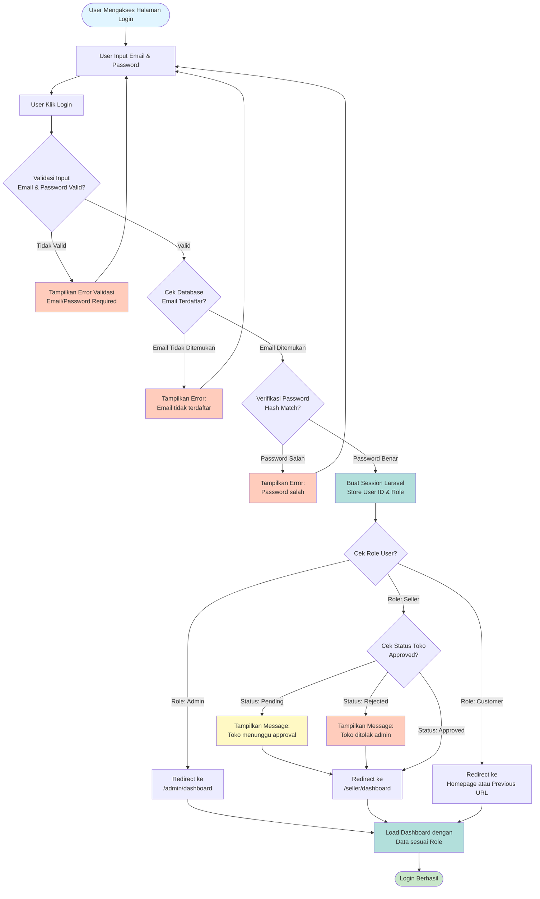

# Activity Diagram - Login dan Autentikasi

## Proses: Login dan Autentikasi Multi-Role

## Penjelasan Alur:

### 1. **Input & Validasi Awal**
- User mengakses halaman `/login`
- Input email dan password
- Client-side validation (required fields)

### 2. **Verifikasi Database**
- Cek apakah email terdaftar di tabel `users`
- Jika tidak ditemukan → Error "Email tidak terdaftar"

### 3. **Verifikasi Password**
- Hash password input dibandingkan dengan hash di database
- Menggunakan `bcrypt` verification
- Jika tidak match → Error "Password salah"

### 4. **Session Creation**
- Laravel membuat session dengan `Auth::attempt()`
- Store user ID, role, dan data lainnya dalam session
- Generate `remember_token` jika "Remember Me" dicentang

### 5. **Role-Based Redirect**

#### **Admin:**
- Direct redirect ke `/admin/dashboard`
- Akses penuh ke semua fitur admin

#### **Seller:**
- Cek status toko di tabel `stores`
- **Status Pending**: Redirect ke dashboard dengan notifikasi menunggu approval
- **Status Rejected**: Redirect dengan notifikasi penolakan
- **Status Approved**: Redirect ke dashboard dengan akses penuh

#### **Customer:**
- Redirect ke homepage atau URL sebelum login (intended URL)
- Session keranjang digabungkan jika ada

### 6. **Completion**
- Dashboard/Homepage dimuat dengan data sesuai role
- Navbar menampilkan menu sesuai hak akses

---

## Security Features:
- ✅ Password hashing dengan bcrypt
- ✅ CSRF token protection
- ✅ Rate limiting (mencegah brute force)
- ✅ Session timeout management
- ✅ Remember token untuk "Stay logged in"

---

## Error Handling:
1. **Validation Errors**: Input kosong atau format salah
2. **Authentication Errors**: Email tidak ditemukan atau password salah
3. **Authorization Errors**: Toko seller belum di-approve
