# Activity Diagram - Payment Validation by Seller

## Proses: Validasi Bukti Transfer oleh Seller

```mermaid
flowchart TD
    Start([Customer Upload<br/>Bukti Transfer]) --> SaveProof[System Save Proof Image<br/>UPDATE orders<br/>SET proof_of_transfer<br/>status = 'menunggu_validasi']
    
    SaveProof --> TriggerEvent[Laravel Event:<br/>OrderPaymentUploaded<br/>Dispatch to Echo Server]
    
    TriggerEvent --> SellerReceiveNotif[Seller Dashboard<br/>Receive Real-time Notification:<br/>- Sound Alert<br/>- Toast Message<br/>- Badge Update]
    
    SellerReceiveNotif --> SellerViewOrders[Seller Buka Menu<br/>/seller/orders]
    
    SellerViewOrders --> DisplayOrderList[Tampilkan Daftar Order<br/>Filter by Status:<br/>'Menunggu Validasi']
    
    DisplayOrderList --> SellerSelectOrder[Seller Klik<br/>'Lihat Detail' Order]
    
    SellerSelectOrder --> ShowOrderDetail[Tampilkan Detail Order:<br/>- Order Code<br/>- Customer Info<br/>- Items List<br/>- Total Amount<br/>- Shipping Address<br/>- Payment Method<br/>- Bukti Transfer Image]
    
    ShowOrderDetail --> SellerViewProof[Seller Klik<br/>Lihat Bukti Transfer<br/>Modal/Lightbox Popup]
    
    SellerViewProof --> DisplayProofImage[Tampilkan Full Image<br/>Bukti Transfer:<br/>- Screenshot transfer<br/>- Nama pengirim<br/>- Jumlah transfer<br/>- Tanggal transfer]
    
    DisplayProofImage --> SellerCheckBankMutation[Seller Cek Manual:<br/>Internet Banking /<br/>Mobile Banking<br/>Mutasi Rekening]
    
    SellerCheckBankMutation --> SellerCompareData[Seller Bandingkan:<br/>- Jumlah transfer vs Order total<br/>- Nama pengirim<br/>- Tanggal transfer<br/>- Nomor referensi]
    
    SellerCompareData --> SellerDecision{Validasi<br/>Pembayaran?}
    
    %% APPROVE FLOW
    SellerDecision -->|APPROVE - Uang Masuk| ClickApprove[Seller Klik Tombol<br/>'Approve Pembayaran']
    
    ClickApprove --> ConfirmApproval{Konfirmasi<br/>Approval?}
    
    ConfirmApproval -->|Cancel| ShowOrderDetail
    
    ConfirmApproval -->|Confirm| UpdateOrderApproved[UPDATE orders SET:<br/>payment_status = 'verified'<br/>status = 'diproses'<br/>verified_at = NOW]
    
    UpdateOrderApproved --> LogApprovalActivity[Log Activity:<br/>- Who approved<br/>- When approved<br/>- Previous status<br/>- New status]
    
    LogApprovalActivity --> TriggerApprovedEvent[Laravel Event:<br/>OrderStatusUpdated<br/>status: 'diproses']
    
    TriggerApprovedEvent --> SendNotifToCustomer[Kirim Notifikasi<br/>ke Customer:<br/>'Pembayaran telah diverifikasi<br/>Pesanan sedang diproses']
    
    SendNotifToCustomer --> UpdateSellerDashboard[Update Seller Dashboard:<br/>- Badge 'Menunggu Validasi' -1<br/>- Badge 'Diproses' +1<br/>- Revenue statistics +total]
    
    UpdateSellerDashboard --> SellerNextAction[Seller Dapat:<br/>- Siapkan barang<br/>- Update status 'Dikirim'<br/>- Print Invoice/Label]
    
    SellerNextAction --> EndApproved([Order Status: Diproses<br/>Ready for Shipment])
    
    %% REJECT FLOW
    SellerDecision -->|REJECT - Data Tidak Sesuai| ClickReject[Seller Klik Tombol<br/>'Tolak Pembayaran']
    
    ClickReject --> InputRejectionReason[Seller Input<br/>Alasan Penolakan:<br/>- Jumlah tidak sesuai<br/>- Nama tidak sesuai<br/>- Transfer ke rekening salah<br/>- Bukti tidak valid]
    
    InputRejectionReason --> ConfirmRejection{Konfirmasi<br/>Rejection?}
    
    ConfirmRejection -->|Cancel| ShowOrderDetail
    
    ConfirmRejection -->|Confirm| UpdateOrderRejected[UPDATE orders SET:<br/>payment_status = 'failed'<br/>status = 'pending'<br/>rejection_reason = reason<br/>rejected_at = NOW]
    
    UpdateOrderRejected --> RestoreProductStock[OPTIONAL:<br/>Restore Product Stock<br/>UPDATE products<br/>SET stock = stock + qty]
    
    RestoreProductStock --> TriggerRejectedEvent[Laravel Event:<br/>OrderPaymentRejected]
    
    TriggerRejectedEvent --> SendNotifRejection[Kirim Notifikasi<br/>ke Customer:<br/>'Pembayaran ditolak'<br/>+ Alasan<br/>+ Instruksi re-upload]
    
    SendNotifRejection --> CustomerCanReupload[Customer Dapat:<br/>- Upload bukti baru<br/>- Contact seller<br/>- Cancel order]
    
    CustomerCanReupload --> EndRejected([Order Status: Pending<br/>Waiting Customer Action])
    
    %% COD FLOW
    Start2([Order COD<br/>Created]) --> SellerViewCOD[Seller Lihat Order COD<br/>Status: 'Pending'<br/>Payment: COD]
    
    SellerViewCOD --> SellerDecideCOD{Seller<br/>Terima Order COD?}
    
    SellerDecideCOD -->|APPROVE COD| ApproveCODOrder[Seller Klik<br/>'Terima Pesanan']
    
    ApproveCODOrder --> UpdateCODApproved[UPDATE orders SET:<br/>status = 'diproses'<br/>payment_status = 'unpaid'<br/>Note: Payment will be<br/>verified after delivery]
    
    UpdateCODApproved --> NotifyCODCustomer[Notifikasi Customer:<br/>'Pesanan COD diterima<br/>Sedang disiapkan']
    
    NotifyCODCustomer --> SellerPrepareShipment[Seller Siapkan<br/>Barang untuk Dikirim<br/>Customer bayar saat terima]
    
    SellerPrepareShipment --> EndCODApproved([Order COD: Diproses<br/>Payment after Delivery])
    
    SellerDecideCOD -->|REJECT COD| RejectCODOrder[Seller Klik<br/>'Tolak Pesanan'<br/>+ Input alasan]
    
    RejectCODOrder --> UpdateCODRejected[UPDATE orders SET:<br/>status = 'dibatalkan'<br/>+ Restore stock]
    
    UpdateCODRejected --> NotifyCODRejection[Notifikasi Customer:<br/>'Pesanan COD ditolak'<br/>+ Alasan]
    
    NotifyCODRejection --> EndCODRejected([Order COD: Dibatalkan])
    
    style Start fill:#e1f5ff
    style Start2 fill:#e1f5ff
    style EndApproved fill:#c8e6c9
    style EndRejected fill:#ffccbc
    style EndCODApproved fill:#c8e6c9
    style EndCODRejected fill:#ffccbc
    style UpdateOrderApproved fill:#c8e6c9
    style UpdateOrderRejected fill:#ffccbc
    style TriggerApprovedEvent fill:#b2dfdb
    style TriggerRejectedEvent fill:#ffccbc
    style SellerCheckBankMutation fill:#fff9c4
```



## Penjelasan Detail Alur:

### **FASE 1: Notifikasi Real-time ke Seller**

#### **Event Trigger:**
```php
// When customer uploads proof
event(new OrderPaymentUploaded($order));
```

#### **Laravel Echo - Seller Dashboard:**
```javascript
// resources/views/layouts/dashboard.blade.php
Echo.private(`stores.${storeId}`)
    .listen('OrderPaymentUploaded', (event) => {
        // 1. Play notification sound
        let audio = new Audio('/sounds/notification.mp3');
        audio.play();
        
        // 2. Show toast notification
        Livewire.dispatch('show-toast', {
            message: 'Bukti pembayaran baru diterima!',
            type: 'info'
        });
        
        // 3. Update badge count
        let badge = document.querySelector('.badge-pending-validation');
        badge.textContent = parseInt(badge.textContent) + 1;
        badge.classList.add('animate-pulse');
        
        // 4. Refresh order list if on orders page
        if (window.location.pathname.includes('/seller/orders')) {
            Livewire.dispatch('refresh-orders');
        }
    });
```

---

### **FASE 2: Seller Review Process**

#### **Order Detail Display:**

**Route:** `/seller/orders/{orderId}`

**Data Displayed:**
```php
$order = Order::with([
    'customer',
    'items.product',
    'store'
])->findOrFail($orderId);

return view('seller.orders.show', [
    'order' => $order,
    'proofImageUrl' => Storage::url($order->proof_of_transfer),
    'totalAmount' => $order->total_price + $order->shipping_cost,
    'customerName' => $order->customer->name,
    'customerPhone' => $order->customer->phone,
    'shippingAddress' => $order->shipping_address,
    'paymentMethod' => $order->payment_method,
    'orderItems' => $order->items,
]);
```

**UI Elements:**
```html
<!-- Order Header -->
Order Code: #ORD-20260608-001
Status: Menunggu Validasi ⏳
Payment: Transfer Bank

<!-- Customer Info -->
Nama: John Doe
Telp: 081234567890
Alamat: Jl. Contoh No. 123, Jakarta

<!-- Items List -->
├─ Produk A × 2 = Rp 100.000
├─ Produk B × 1 = Rp 50.000
└─ Ongkir = Rp 10.000
   ──────────────────────
   Total: Rp 160.000

<!-- Proof of Transfer -->
[📷 Lihat Bukti Transfer] ← Button to open modal
```

---

### **FASE 3: Manual Validation by Seller**

#### **Seller Checklist:**

Seller harus memverifikasi secara manual dengan cara:

**1. Buka Mobile Banking / Internet Banking**
```
Contoh: BCA Mobile
Menu: Mutasi Rekening
Filter: Hari ini / 3 hari terakhir
```

**2. Cari Transaksi Masuk**
```
Cek:
✓ Jumlah transfer = Rp 160.000 (match dengan order total)
✓ Nama pengirim = John Doe (atau atas nama customer)
✓ Tanggal/waktu = Sesuai dengan waktu upload bukti
✓ No. referensi = (jika ada di bukti)
```

**3. Bandingkan dengan Bukti Transfer**
```
Screenshot bukti customer harus menunjukkan:
✓ Nama bank penerima
✓ No. rekening penerima (rekening toko)
✓ Jumlah transfer
✓ Biaya admin (jika ada)
✓ Status: Berhasil
✓ Tanggal & waktu
```

#### **Validation Scenarios:**

**✅ VALID - Approve:**
- Jumlah transfer EXACT match
- Nama pengirim sesuai/reasonable
- Transfer ke rekening yang benar
- Tanggal masuk akal (tidak lampau/masa depan)

**❌ INVALID - Reject:**
- Jumlah transfer tidak sesuai (kurang/lebih)
- Transfer ke rekening lain (bukan rekening toko)
- Bukti transfer palsu/edit
- Tanggal transfer tidak masuk akal
- Nama penerima bukan nama toko

---

### **FASE 4A: APPROVE Payment**

#### **Approval Process:**
```php
// Seller clicks "Approve" button
public function approvePayment($orderId)
{
    $order = Order::where('store_id', Auth::user()->store->id)
                  ->findOrFail($orderId);
    
    // Confirm action
    $this->dispatch('confirm-approval', [
        'title' => 'Approve Pembayaran?',
        'message' => 'Pastikan dana sudah masuk ke rekening Anda',
        'orderCode' => $order->order_code,
        'amount' => $order->total_price
    ]);
}

public function confirmApproval($orderId)
{
    DB::transaction(function() use ($orderId) {
        $order = Order::lockForUpdate()->findOrFail($orderId);
        
        // Update order status
        $order->update([
            'payment_status' => 'verified',
            'status' => 'diproses',
            'verified_at' => now(),
            'verified_by' => Auth::id()
        ]);
        
        // Log activity
        ActivityLog::create([
            'order_id' => $order->id,
            'action' => 'payment_approved',
            'performed_by' => Auth::id(),
            'details' => json_encode([
                'previous_status' => 'menunggu_validasi',
                'new_status' => 'diproses'
            ])
        ]);
        
        // Trigger event
        event(new OrderStatusUpdated($order));
        
        // Update seller revenue statistics
        $this->updateRevenueStats($order);
    });
    
    // Success notification
    $this->dispatch('toast', [
        'message' => 'Pembayaran berhasil diverifikasi',
        'type' => 'success'
    ]);
}
```

#### **Post-Approval Actions:**

**1. Customer Notification:**
```php
// Laravel Event Listener
class SendOrderApprovedNotification
{
    public function handle(OrderStatusUpdated $event)
    {
        $order = $event->order;
        
        // Email notification (queued)
        Mail::to($order->customer->email)
            ->queue(new PaymentVerifiedMail($order));
        
        // SMS notification (optional)
        SMS::send($order->customer->phone, 
            "Pembayaran order #{$order->order_code} telah diverifikasi. Pesanan sedang diproses.");
    }
}
```

**2. Seller Dashboard Update:**
```php
// Update badge counts
$pendingValidation = Order::where('status', 'menunggu_validasi')->count();
$inProcess = Order::where('status', 'diproses')->count();

// Update revenue statistics
$totalRevenue = Order::where('store_id', $storeId)
                    ->whereIn('status', ['diproses', 'dikirim', 'selesai'])
                    ->sum('total_price');
```

**3. Next Seller Actions:**
```
Seller sekarang bisa:
├─ Siapkan barang untuk dikirim
├─ Update status ke "Dikirim" + input resi
├─ Print invoice/label pengiriman
└─ View updated sales statistics
```

---

### **FASE 4B: REJECT Payment**

#### **Rejection Process:**
```php
public function rejectPayment($orderId, $reason)
{
    DB::transaction(function() use ($orderId, $reason) {
        $order = Order::lockForUpdate()->findOrFail($orderId);
        
        // Update order status
        $order->update([
            'payment_status' => 'failed',
            'status' => 'pending',
            'rejection_reason' => $reason,
            'rejected_at' => now(),
            'rejected_by' => Auth::id()
        ]);
        
        // Restore product stock (optional)
        foreach ($order->items as $item) {
            $item->product->increment('stock', $item->qty);
        }
        
        // Trigger event
        event(new OrderPaymentRejected($order));
    });
    
    // Notification
    $this->dispatch('toast', [
        'message' => 'Pembayaran ditolak',
        'type' => 'error'
    ]);
}
```

#### **Rejection Reasons (Dropdown):**
```php
$rejectionReasons = [
    'Jumlah transfer tidak sesuai',
    'Transfer ke rekening yang salah',
    'Bukti transfer tidak valid',
    'Nama pengirim tidak sesuai',
    'Transaksi tidak ditemukan di mutasi',
    'Lainnya (custom input)'
];
```

#### **Customer Follow-up:**
```php
// Notification to customer
Mail::to($order->customer->email)
    ->queue(new PaymentRejectedMail($order, $reason));

// Customer sees rejection on order detail page
"❌ Pembayaran ditolak
 Alasan: {$reason}
 
 Silakan:
 ├─ Upload bukti transfer yang benar
 ├─ Hubungi penjual untuk klarifikasi
 └─ Batalkan pesanan"
```

---

### **FASE 5: COD Order Handling**

#### **COD Approval:**
```php
// No proof needed, seller just confirms order
public function approveCODOrder($orderId)
{
    $order = Order::where('payment_method', 'cod')
                  ->findOrFail($orderId);
    
    $order->update([
        'status' => 'diproses',
        'payment_status' => 'unpaid', // Will be paid on delivery
    ]);
    
    // Notify customer
    event(new OrderStatusUpdated($order));
}
```

#### **COD Payment Validation:**
```
Timeline COD:
1. Order created → status: 'pending'
2. Seller approve → status: 'diproses', payment: 'unpaid'
3. Seller ship → status: 'dikirim', payment: 'unpaid'
4. Customer receive + pay → status: 'selesai', payment: 'paid'
```

**Note:** COD payment is validated AFTER delivery, not before shipment.

---

## Database State Changes:

### **Approval:**
```sql
UPDATE orders 
SET 
    payment_status = 'verified',
    status = 'diproses',
    verified_at = NOW(),
    verified_by = {seller_user_id}
WHERE id = {order_id}
  AND store_id = {seller_store_id}
  AND status = 'menunggu_validasi';
```

### **Rejection:**
```sql
UPDATE orders 
SET 
    payment_status = 'failed',
    status = 'pending',
    rejection_reason = {reason},
    rejected_at = NOW(),
    rejected_by = {seller_user_id}
WHERE id = {order_id};

-- Optional: Restore stock
UPDATE products p
JOIN order_items oi ON p.id = oi.product_id
SET p.stock = p.stock + oi.qty
WHERE oi.order_id = {order_id};
```

---

## Security & Business Rules:

### 🔒 **Security:**
1. ✅ Only seller of the store can validate their orders
2. ✅ CSRF token on all approval/rejection actions
3. ✅ Confirmation modal before approval/rejection
4. ✅ Activity logging for audit trail
5. ✅ Pessimistic locking during update (prevent race condition)

### 📋 **Business Rules:**
1. ✅ Seller MUST manually check bank mutation (no auto-verify)
2. ✅ Rejection allows customer to re-upload
3. ✅ Stock restoration is OPTIONAL on rejection (configurable)
4. ✅ COD orders skip payment validation until delivery
5. ✅ Multiple payment methods per store supported

### ⚡ **Real-time Features:**
1. ✅ Instant notification via Laravel Echo
2. ✅ Sound alert on new proof upload
3. ✅ Live badge count update
4. ✅ Auto-refresh order list (optional)

### 📊 **Analytics Impact:**
- Approval → Revenue statistics updated
- Rejection → Does NOT count as revenue
- COD → Counted as revenue after delivery confirmation

---

## Error Handling:

**Concurrent Validation:**
```php
// Prevent two sellers validating same order (race condition)
DB::transaction(function() {
    $order = Order::lockForUpdate()->findOrFail($orderId);
    
    if ($order->payment_status !== 'paid') {
        throw new \Exception('Order sudah divalidasi');
    }
    
    // Proceed with validation
});
```

**Network Error:**
```php
// If Echo connection lost
if (!window.Echo.connector.pusher.connection.state === 'connected') {
    // Fallback: Poll for new orders every 30s
    setInterval(() => {
        Livewire.dispatch('check-new-orders');
    }, 30000);
}
```
